<div align="center">


# Kounter

### हर माल गिना हुआ · every item counted, built for the **iQOO 15**

**An offline-first shop-audit concept that turns the iQOO 15's sensors into a delivery counter, expiry gate, freezer remote and Hindi voice assistant for India's small shops.**

<br/>


**iQOO Hackathon 2026** · Team **HoloTrio** · Track: Productivity + Open Innovation

[Quick start](#quick-start) · [Prototype only](#quick-start) · [Architecture](#target-architecture) · [Engineering spec](docs/04_engineering/TECHNICAL_SPEC_AND_ROADMAP.md) · [Master document](docs/01_pitch/master.md)

<br/>

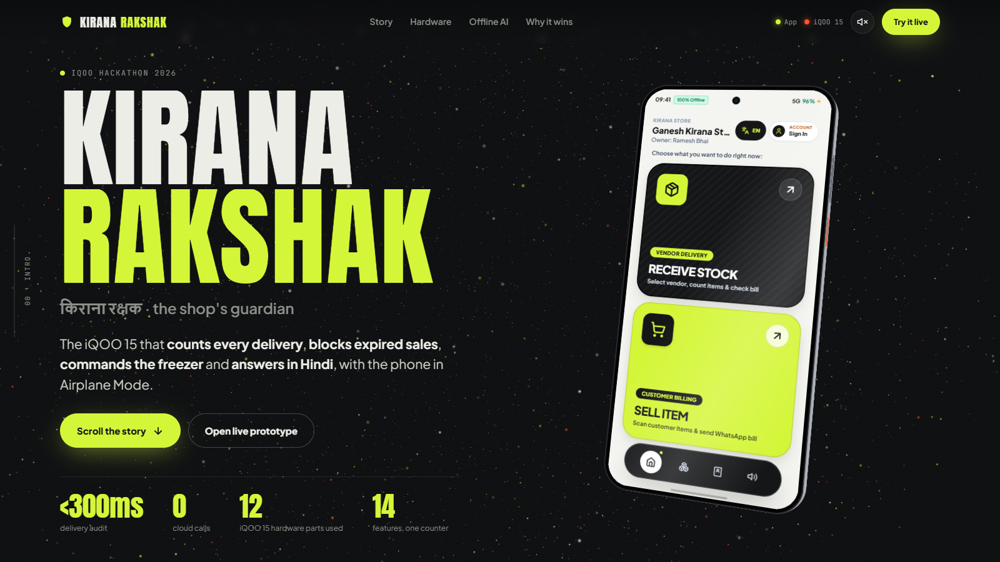

</div>

---

## Contents

- [Project status](#project-status-read-this-first)
- [The problem](#the-problem)
- [The solution](#the-solution)
- [Why only an iQOO 15](#why-only-an-iqoo-15)
- [A day at the counter](#a-day-at-the-counter)
- [Target architecture](#target-architecture)
- [Tech stack](#tech-stack)
- [Quick start](#quick-start)
- [Project structure](#project-structure)
- [Limitations](#limitations)
- [Documentation](#documentation)
- [Team](#team)

---

## Project status (read this first)

This repository is **a design + interactive prototype**, not a working Android app.

| Layer | State | Evidence |
| --- | --- | --- |
| Showcase website: scroll-driven 3D iQOO 15 with GSAP, Lenis and a Three.js particle background | **Implemented** | [`frontend/`](frontend/) |
| App UI prototype: bilingual (English/Hindi) cashier, vendor, stock, voice and IR screens as a single HTML file | **Implemented, scripted** | [`prototype/kounter_ui.html`](prototype/kounter_ui.html) |
| Camera counting, OCR, reconciliation, NFC/NavIC, IR transmit, voice pipeline, SQLite ledger | **Planned**: specified, not built | [Engineering spec](docs/04_engineering/TECHNICAL_SPEC_AND_ROADMAP.md) |

The prototype's actions (NFC check-in, camera scan, IR blast, expired-item block, voice reply) are **simulated in JavaScript** (`simulateNfcCheckIn()`, `simulateScanNewItem()`, `triggerIrBlasterManual()`, `triggerExpiredItemScan()`, and a timed voice-recognition simulation). No models run and no sensors are read. Figures such as "< 300 ms audit", "22 ms YOLO11n" and "0 cloud calls" are **design targets from the pitch documents**, not measurements. The website and prototype themselves load fonts, Tailwind, GSAP, Lenis and Three.js from CDNs, so they need internet access.

---

## The problem

Per the pitch, India has **63 million small businesses** (shops, godowns, factory stores), and each can leak up to **₹31,000 a month** in five places. The rupee figures are the team's estimates; sources are listed in [`docs/02_research/11_SOURCES.md`](docs/02_research/11_SOURCES.md).

| # | Leak | What happens | Est. loss / month |
| :-: | --- | --- | --: |
| 1 | Short deliveries | Bill says 24 Maggi, 20 get unloaded. Nobody counts at 9 AM. | ₹8k – 15k |
| 2 | Stock that expires unseen | Old packets get buried; the 30-day return window is missed. | ₹5k – 10k |
| 3 | Cold-chain spoilage | The freezer gets turned down or the power cuts out. Ice-cream melts. | ₹3k – 6k |
| 4 | Expired sales | One expired packet sold ruins years of customer trust. | trust |
| 5 | Typing & English UIs | Billing apps need typing during a 20-customer rush. | errors |

<div align="center">
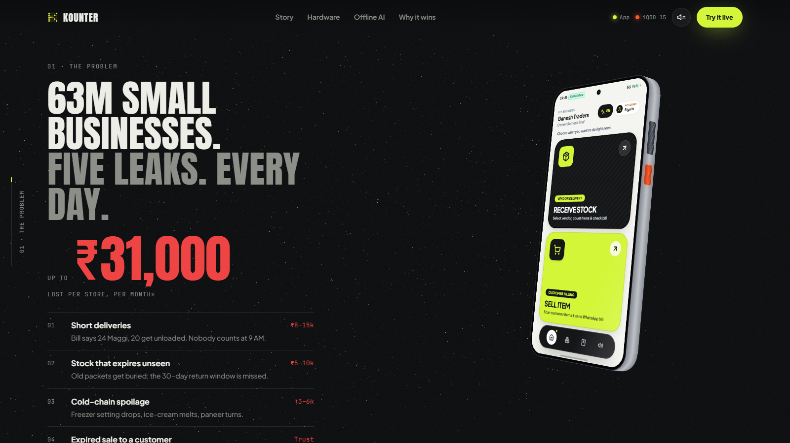
</div>

## The solution

Existing apps only record what the shopkeeper **types**. Kounter is designed to check what **physically arrives and leaves the shop**: count a delivery from one wide photo, match it against the OCR'd bill, block expired sales at the till, lock the freezer into super-freeze over IR, and answer questions in Hindi, all on-device.

---

## Why only an iQOO 15

> **A shop audit needs sensors, not servers.** Every step of the design maps to a specific iQOO 15 part.

<div align="center">
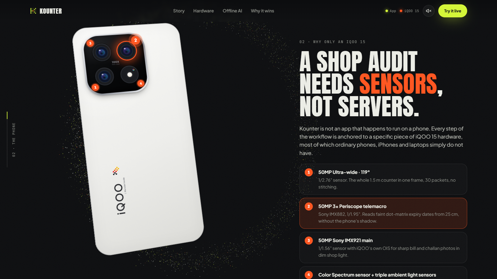
</div>

| iQOO 15 hardware | Spec (from the hardware dossier) | Planned job in Kounter |
| --- | --- | --- |
| **Snapdragon 8 Elite Gen 5 · Hexagon NPU** | 3 nm Oryon CPU, Hexagon NPU 80+ TOPS, INT4/INT8/FP16 | Run YOLO11n, PaddleOCR, Whisper and Laya side by side in INT8, with radios off. |
| **Supercomputing Chip Q3** | Dedicated display co-processor | Draw the 144 Hz AR bounding-box HUD without taking NPU cycles. |
| **IR Blaster** | Top-frame emitter, 36–56 kHz, NEC / RC5 / RC6 | Send a 38 kHz command that puts a deep-freezer into super-freeze. |
| **NavIC L5 dual-band GNSS** | GPS L1+L5, NavIC L5, Galileo, BeiDou, QZSS | Geo-tag each delivery with a SHA-256 hashed proof-of-delivery. |
| **50 MP 3× periscope telemacro** | Sony IMX882, 15 cm macro | Read dot-matrix expiry dates from ~25 cm without shadowing the packet. |
| **50 MP ultra-wide** | Samsung JN1, 119° FoV | Fit the whole 1.5 m counter (~30 packets) in one frame. |
| **50 MP main** | Sony IMX921 | Bill and challan photos in dim shop light. |
| **Color Spectrum sensor + triple ALS** | CCT, 50/60 Hz flicker detection | Lock 50 Hz anti-banding against tube-light flicker. |
| **X-axis linear haptic motor** | Sub-10 ms response | A 500 ms rumble blocks an expired sale, noticeable where a beep is not. |
| **Dual stereo speakers** | Symmetrical, smart PA | A "Kounter Soundbox" that reads answers aloud. |
| **Triple MEMS mic array** | Beamforming, 96 kHz / 24-bit | Hindi / Hinglish questions across a noisy counter. |
| **NFC** | ISO 14443 A/B, ISO 15693, HCE | 1-tap distributor check-in. |
| **3D ultrasonic fingerprint** | Qualcomm 3D Sonic Gen 2 | Lock purchase rates and supplier debts. |
| **7000 mAh battery + vapor chamber** | 100 W FlashCharge | All-day counter use through power cuts. |
| **iQOO Office Kit** | Phone ↔ PC mirroring, shared clipboard | Customer-facing bill mirror and one-click `.xlsx` export. |

Full teardown and what is reachable via SDK/NDK: [Hardware Dossier](docs/02_research/iQOO_15_Hackathon_Hardware_Dossier.md) · [Capability Map](docs/02_research/02_IQOO_CAPABILITY_MAP.md).

<div align="center">
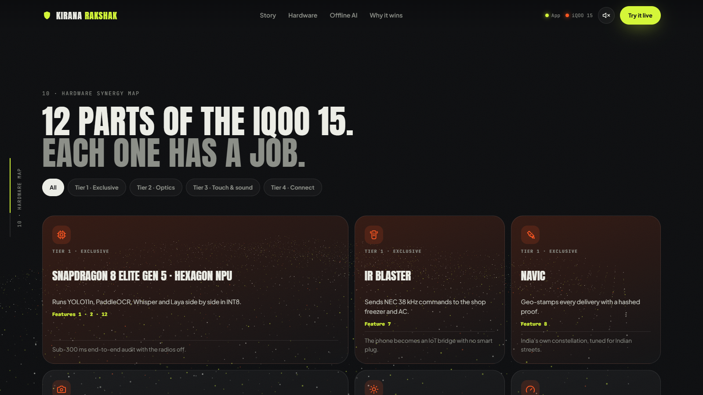
</div>

---

## A day at the counter

The story used by the prototype and the website: a day at *Shree Ganesh Traders* with Ramesh Bhai. Each step is a screen you can trigger in the prototype.

<table>
<tr>
<td width="50%" valign="top">

### 09:00 · Tap. Stamp. Count.
**NFC · NavIC L5 · Color Spectrum · 119° ultra-wide**

The distributor taps his ID card and the vendor ledger opens. The delivery is geo-stamped and one wide photo counts every packet.

</td>
<td width="50%">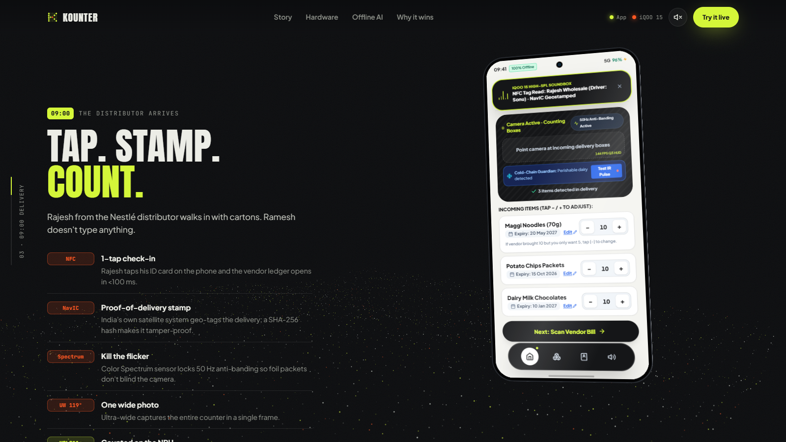</td>
</tr>
<tr>
<td width="50%">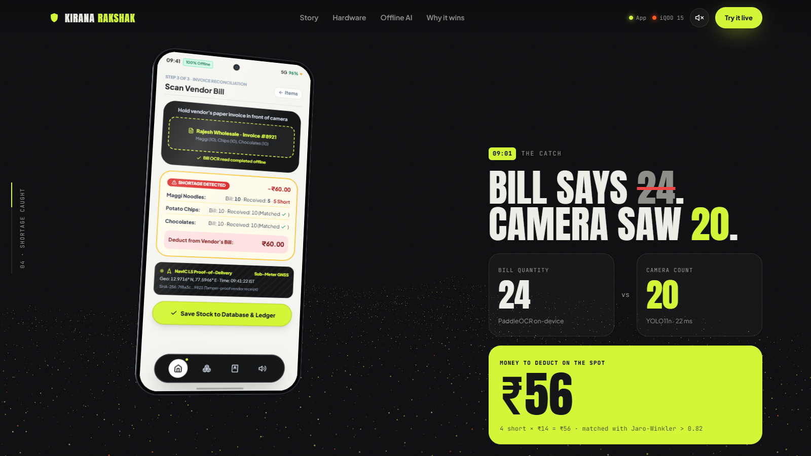</td>
<td width="50%" valign="top">

### 09:01 · Bill says 24. Camera saw 20.
**Hexagon NPU · YOLO11n · PaddleOCR**

Camera count and OCR'd bill are matched by name similarity (Jaro-Winkler > 0.82). 4 short × ₹14 = **₹56 deducted on the spot**.

</td>
</tr>
<tr>
<td width="50%" valign="top">

### 11:30 · The phone talks to the freezer.
**IR Blaster · 3× telemacro**

Ice-cream arrives; the IR blaster sends a 38 kHz `SUPER_FREEZE` command to the old deep-freezer (-18 °C).

</td>
<td width="50%">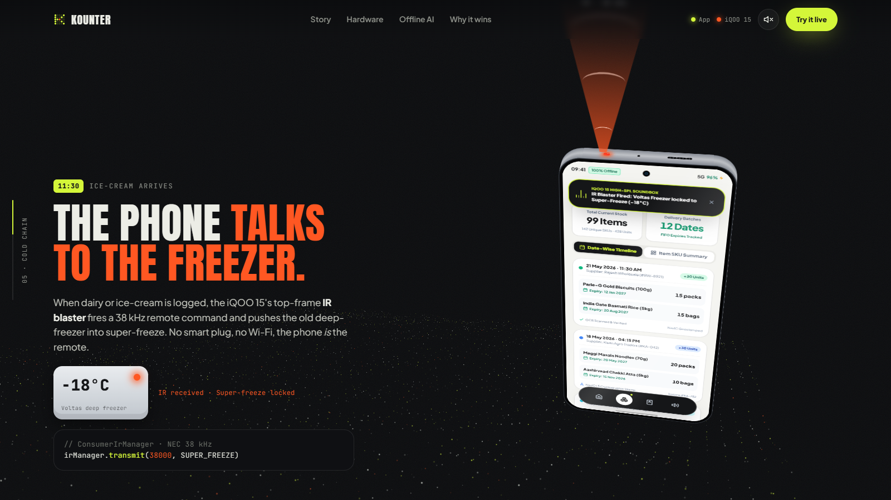</td>
</tr>
<tr>
<td width="50%">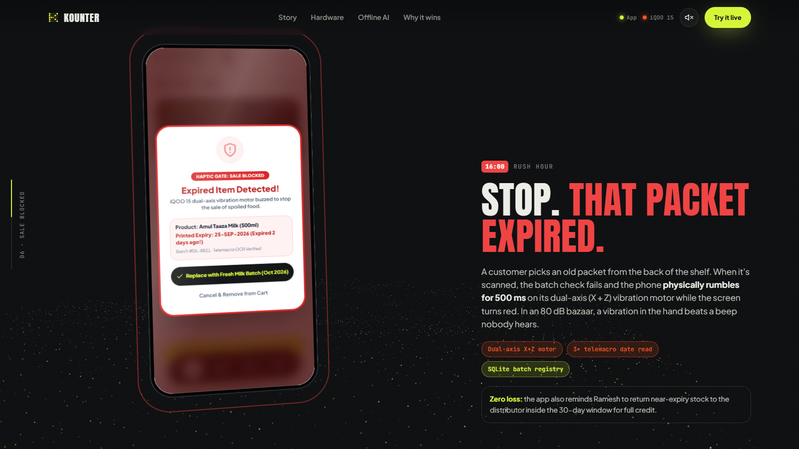</td>
<td width="50%" valign="top">

### 16:00 · Stop. That packet expired.
**X-axis haptics · SQLite batch registry**

An old packet is scanned at the till. The phone **rumbles for 500 ms** and the screen turns red: *Sale blocked*.

</td>
</tr>
<tr>
<td width="50%" valign="top">

### 19:30 · Just ask. In Hindi.
**Mic array · Whisper + Laya on NPU · stereo speakers**

> *"Rajesh vendor ne kitna kam maal diya hai?"*
> *"Rajesh vendor se 4 packet Maggi kam aaye the, kul ₹56 kaatne baaki hain."*

By design the language model only phrases facts fetched from the database; it does not compute numbers.

</td>
<td width="50%">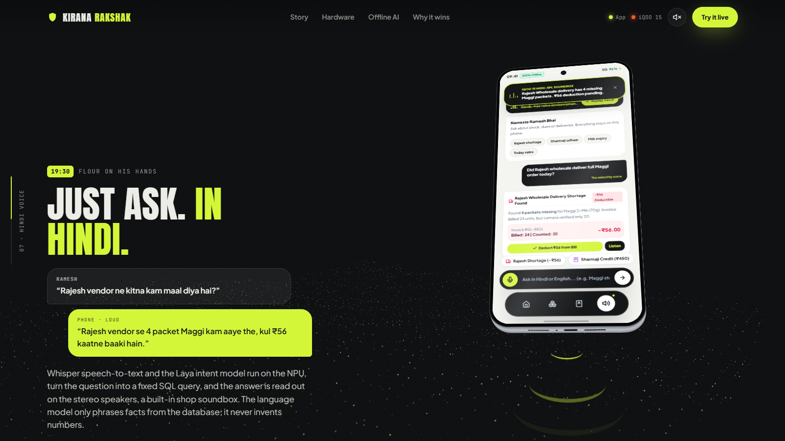</td>
</tr>
<tr>
<td width="50%">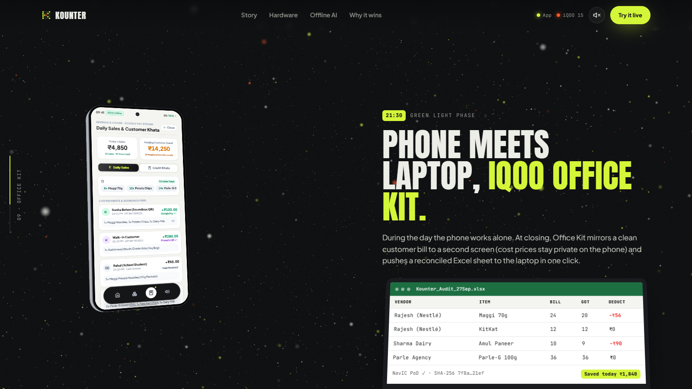</td>
<td width="50%" valign="top">

### 21:30 · Phone meets laptop.
**iQOO Office Kit**

The customer bill is mirrored to a second screen while cost prices stay on the phone. A reconciled `.xlsx` goes to the laptop for GST.

</td>
</tr>
</table>

---

## Target architecture

> **Planned, not yet built.** This is the design from the [engineering spec](docs/04_engineering/TECHNICAL_SPEC_AND_ROADMAP.md) (Kotlin, Jetpack Compose, C++ NDK, LiteRT / QNN, Room/SQLite). The only code in this repo is the web showcase and UI prototype.

<div align="center">
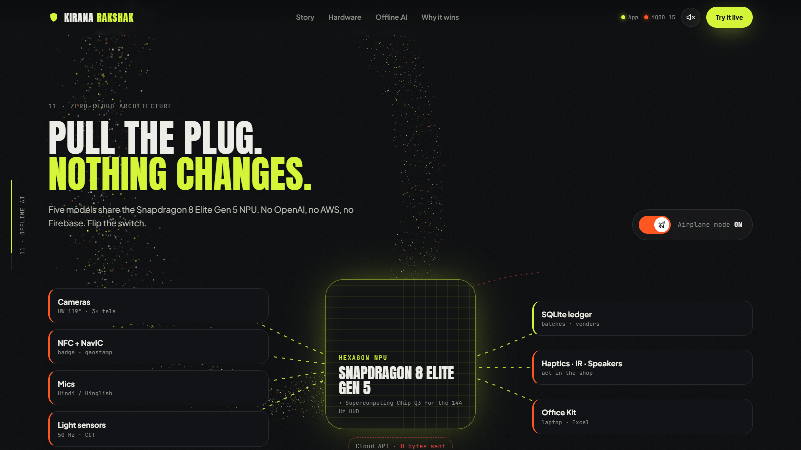
</div>


Sensors feed on-device models; results are reconciled against a local SQLite ledger; the ledger drives the actuators (haptics, IR, speaker, Office Kit). The spec also defines the Room schema, the Office Kit cross-device layout, and a 30-hour build plan.

---

## Tech stack

**What is in this repo today**

| Technology | Purpose |
| --- | --- |
| HTML / CSS / vanilla JS | Showcase site and app prototype, no build step |
| CSS 3D transforms | The 3D iQOO 15 model (no image or WebGL asset) |
| GSAP + ScrollTrigger 3.12.5 (CDN) | Scroll-scrubbed chapter timeline |
| Lenis 1.1.13 (CDN) | Smooth scrolling |
| Three.js 0.160.0 (CDN) | Background particle field |
| Tailwind (CDN build) + Google Fonts | Prototype styling and typography |
| Vercel ([`vercel.json`](vercel.json)) | Static hosting routes: `/` → website, `/app` → prototype |
| PptxGenJS ([`build_deck.js`](docs/05_presentation/build_deck.js)) | Builds the pitch deck |

**Planned for the real app (spec only):** Kotlin, Jetpack Compose, Camera2, C++ NDK, LiteRT / Qualcomm QNN / ONNX Runtime, YOLO11n, PaddleOCR-Mobile v4, Whisper-Small / Sherpa-ONNX, Laya 322M, Room/SQLite, `ConsumerIrManager`.

---

## Quick start

**Prerequisites:** Python 3 (any recent version) and a browser with internet access (for the CDN assets). No install step.

```bash
git clone https://github.com/SanTiwari07/KiranaRakshak.git
cd KiranaRakshak
python -m http.server 5173
```

Serve the **repo root**, not `frontend/` alone: the website loads the app from `../prototype/` and needs same-origin access to it.

| What | URL |
| --- | --- |
| Showcase website | http://localhost:5173/frontend/ (the root `/` also redirects there) |
| App prototype on its own | http://localhost:5173/prototype/kounter_ui.html |

**Verify:** the website should show the 3D iQOO 15 that rotates as you scroll, with the live app on its screen. Opening the prototype directly shows a login screen; the UI hint shows the demo code `123456`.

On Vercel the same routes are `/` and `/app`, per [`vercel.json`](vercel.json). No deployed URL is recorded in this repo.

---

## Project structure

```
KiranaRakshak/
├── index.html                  redirects to frontend/
├── vercel.json                 Vercel routes (/ → site, /app → prototype)
├── frontend/                   showcase website
│   ├── index.html
│   ├── css/style.css
│   ├── js/                     phone.js (3D phone + iframe bridge),
│   │                           particles.js (Three.js), main.js (GSAP timeline)
│   └── IMPLEMENTATION_PLAN.md
├── prototype/
│   └── kounter_ui.html         the app UI (single file, EN/HI, simulated actions)
├── docs/
│   ├── 01_pitch/               master.md, Kounter.md, feature.md, submission portal notes
│   ├── 02_research/            hardware dossier, capability map, market analysis, sources
│   ├── 03_design/design.md     design system
│   ├── 04_engineering/         TECHNICAL_SPEC_AND_ROADMAP.md
│   └── 05_presentation/        pitch deck (.pptx) + build_deck.js
└── assets/                     screenshots, logos
```

---

## Limitations

- **No native app.** There is no Android/Kotlin code, no model files and no inference code in this repository.
- **Prototype interactions are scripted.** Counting, OCR, NFC, NavIC, IR, haptics (a CSS shake plus `navigator.vibrate`) and voice are simulated with fixed data.
- **Performance and "zero cloud" claims are targets**, not benchmarks. The web pages themselves depend on CDNs.
- **Loss estimates** (₹31k/month, 63 million businesses) come from the team's research documents and were not independently verified here.
- Whether every planned hardware capability (e.g. IR access, NavIC L5 flags) is reachable from third-party apps is analysed in the [Capability Map](docs/02_research/02_IQOO_CAPABILITY_MAP.md); the app is untested on a real device.
- No automated tests or CI are configured.

## Documentation

| Document | What it covers |
| --- | --- |
| [Master document](docs/01_pitch/master.md) | All 14 features, user story, scorecard, demo script |
| [Engineering spec & roadmap](docs/04_engineering/TECHNICAL_SPEC_AND_ROADMAP.md) | Architecture, code sketches, DB schema, 30-hour plan |
| [Hardware dossier](docs/02_research/iQOO_15_Hackathon_Hardware_Dossier.md) | iQOO 15 subsystem teardown |
| [Market & winner analysis](docs/02_research/04_MARKET_AND_WINNER_ANALYSIS.md) · [Opportunity gaps](docs/02_research/05_OPPORTUNITY_GAPS.md) | Positioning research |
| [Design system](docs/03_design/design.md) | Colors, type, UI rules |
| [Website plan](frontend/IMPLEMENTATION_PLAN.md) | How the scroll-driven site is built |
| [Pitch deck](docs/05_presentation/Kounter_iQOO_Hackathon_2026.pptx) | Hackathon presentation |

---

## Team

<div align="center">

**Team HoloTrio** · Sanskar Tiwari · Shambhavi Patil · Kanishka Salgude

Built for the **iQOO Hackathon 2026** Grand Finale, Bengaluru. Planned role split: see the [engineering spec](docs/04_engineering/TECHNICAL_SPEC_AND_ROADMAP.md#member-responsibility-matrix).

</div>

No license file is present in the repository; all rights are reserved by default until one is added.
