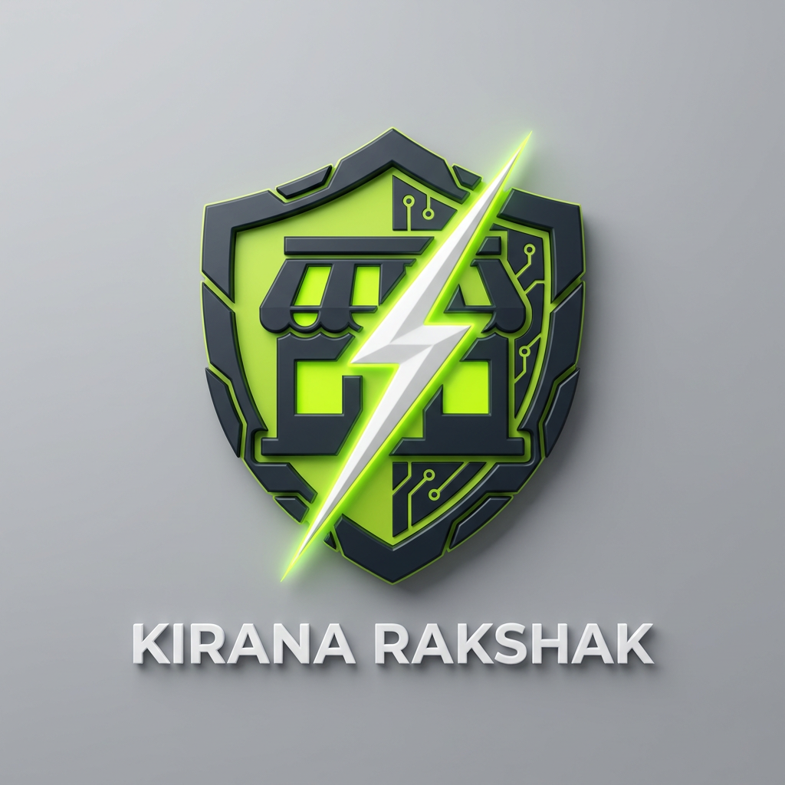
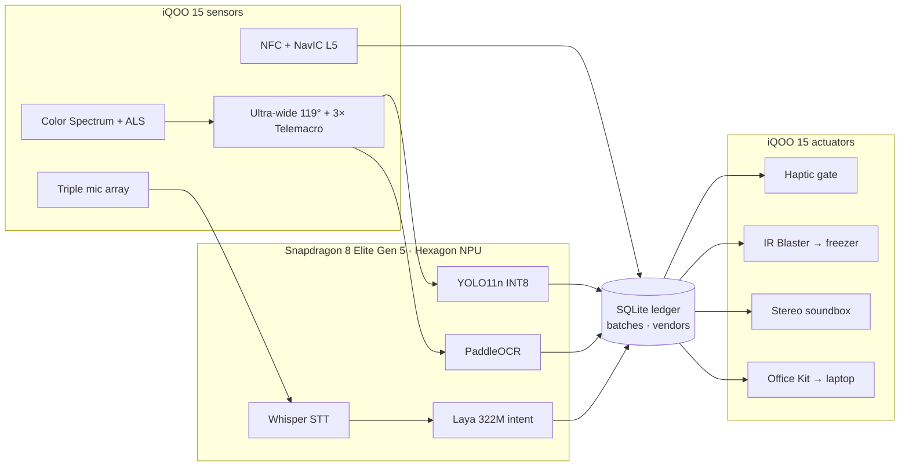

<div align="center">



# Kirana Rakshak

### किराना रक्षक · the shop's guardian, built on the **iQOO 15**

**The iQOO 15 counts every delivery, blocks expired sales, controls the freezer and answers in Hindi, with the phone in Airplane Mode.**

<br/>


**iQOO Hackathon 2026** · Team **HoloTrio** · Track: Productivity + Open Innovation

<br/>


</div>

<br/>

<div align="center">

| **< 300 ms** | **0** | **12** | **14** |
| :---: | :---: | :---: | :---: |
| delivery audit, end to end | cloud calls | iQOO 15 hardware parts used | features on one counter |

</div>

---

## The problem

India has **12 million kirana stores**. Each one leaks money in five places every day, up to **₹31,000 a month**:

| # | Leak | What happens | Loss / month |
| :-: | --- | --- | --: |
| 1 | Short deliveries | Bill says 24 Maggi, 20 get unloaded. Nobody counts at 9 AM. | ₹8k – 15k |
| 2 | Stock that expires unseen | Old packets get buried; the 30-day return window is missed. | ₹5k – 10k |
| 3 | Cold-chain spoilage | The freezer gets turned down or the power cuts out. Ice-cream melts. | ₹3k – 6k |
| 4 | Expired sales | One expired packet sold ruins years of customer trust. | trust |
| 5 | Typing & English UIs | Billing apps need typing during a 20-customer rush. | errors |

Existing apps only record what the shopkeeper **types**. Kirana Rakshak checks what **physically arrives and leaves the shop**, using hardware that only the iQOO 15 puts in one pocket.

<div align="center">

</div>

---

## Why only an iQOO 15

> **A shop audit needs sensors, not servers.**
> Every step of the workflow depends on a specific part of the iQOO 15. Most ordinary phones, iPhones and laptops don't have these parts.

<div align="center">

</div>

### The hardware, and the job each part does

| iQOO 15 hardware | Spec | Job in Kirana Rakshak |
| --- | --- | --- |
| **Snapdragon 8 Elite Gen 5 · Hexagon NPU** | 3 nm Oryon CPU (2× 4.32 GHz + 6× 3.53 GHz), Hexagon NPU 80+ TOPS, INT4/INT8/FP16 | Runs YOLO11n, PaddleOCR, Whisper and Laya side by side in INT8. Sub-300 ms audit with the radios off. |
| **Supercomputing Chip Q3** | Dedicated display co-processor | Draws the 144 Hz AR bounding-box HUD over 30+ packets without taking cycles from the NPU. |
| **IR Blaster** | Top-frame emitter, 36–56 kHz, NEC / RC5 / RC6 | Fires a 38 kHz command that puts the shop's deep-freezer into super-freeze. The phone acts as the remote, with no smart plug. |
| **NavIC L5 dual-band GNSS** | GPS L1+L5, **NavIC L5**, Galileo, BeiDou, QZSS | Geo-tags every delivery with a SHA-256 hashed, tamper-proof proof-of-delivery. |
| **50 MP 3× Periscope telemacro** | Sony IMX882, 1/1.95", 73 mm, OIS, 15 cm macro | Reads faint dot-matrix expiry dates from 25 cm away without the phone's shadow on the packet. |
| **50 MP Ultra-wide** | Samsung JN1, 1/2.76", 119° FoV | Fits the whole 1.5 m counter (30 packets) in one frame, no stitching. |
| **50 MP Main** | Sony IMX921 VCS, 1/1.56", f/1.68, OIS | Sharp bill and challan photos in dim shop light. |
| **Color Spectrum Sensor + Triple ALS** | CCT (Kelvin), 50/60 Hz flicker detection | Locks 50 Hz anti-banding so tube-light flicker and foil glare don't blind the camera. |
| **X-axis linear haptic motor** | Sub-10 ms response, 150–220 Hz | A 500 ms rumble blocks an expired sale. In an 80 dB bazaar, a vibration in the hand is noticed where a beep is not. |
| **Dual stereo speakers** | Symmetrical, smart PA | A built-in "Kirana Soundbox" that reads Hindi answers aloud and saves ₹125/month in soundbox rent. |
| **Triple MEMS mic array** | Beamforming, 96 kHz / 24-bit | Picks up Hindi / Hinglish questions across a noisy counter. |
| **NFC** | ISO 14443 A/B, ISO 15693, HCE | 1-tap distributor check-in. The vendor ledger opens in < 100 ms. |
| **3D Ultrasonic fingerprint** | Qualcomm 3D Sonic Gen 2 | Locks purchase rates and supplier debts. Works through flour, dust and oil on the shopkeeper's fingers. |
| **7000 mAh Si-C battery + vapor chamber** | 100 W FlashCharge, 7000+ mm² VC | 12 hours on the counter below 37 °C, through power cuts. |
| **iQOO Office Kit** | Phone ↔ PC mirroring, drag-and-drop, shared clipboard | Shows the customer bill on a second screen and sends a reconciled Excel sheet to the laptop in one click. |

<div align="center">

</div>

### Hardware tiers

| Tier | Parts | Why it matters |
| --- | --- | --- |
| **1 · Exclusive** | Hexagon NPU · IR Blaster · NavIC L5 | Not available on iPhones, most Samsungs or laptops. |
| **2 · Optics** | Ultra-wide + 3× telemacro fusion · Color Spectrum sensor · Q3 chip | Flagship-grade optics and display offload. |
| **3 · Touch & sound** | Linear haptics · stereo speakers · 7000 mAh + VC · ultrasonic fingerprint | Built for noisy, dusty, all-day counter use. |
| **4 · Connect** | iQOO Office Kit · NFC | Hands-free intake and the laptop bridge at closing time. |

---

## A day at the counter

A day at *Shree Ganesh Kirana* with Ramesh Bhai, and the iQOO 15 hardware used at each step.

<table>
<tr>
<td width="50%" valign="top">

### 09:00 · Tap. Stamp. Count.
**NFC · NavIC L5 · Color Spectrum · 119° Ultra-wide**

The distributor taps his ID card and the vendor ledger opens. NavIC geo-stamps the delivery. The spectrum sensor stops the flicker, and one wide photo counts every packet.

</td>
<td width="50%"></td>
</tr>
<tr>
<td width="50%"></td>
<td width="50%" valign="top">

### 09:01 · Bill says 24. Camera saw 20.
**Hexagon NPU · YOLO11n (22 ms) · PaddleOCR**

The camera count and the OCR'd bill are matched with Jaro-Winkler > 0.82. 4 short × ₹14 = **₹56 deducted on the spot**.

</td>
</tr>
<tr>
<td width="50%" valign="top">

### 11:30 · The phone talks to the freezer.
**IR Blaster · 3× Telemacro**

Ice-cream arrives. The telemacro reads its expiry, and the IR blaster sends `transmit(38000, SUPER_FREEZE)` to the old Voltas deep-freezer, which goes to -18 °C.

</td>
<td width="50%"></td>
</tr>
<tr>
<td width="50%"></td>
<td width="50%" valign="top">

### 16:00 · Stop. That packet expired.
**X-axis haptics · SQLite batch registry**

An old packet from the back shelf is scanned at the till. The phone **rumbles for 500 ms** and the screen turns red: *Sale blocked*.

</td>
</tr>
<tr>
<td width="50%" valign="top">

### 19:30 · Just ask. In Hindi.
**Mic array · Whisper + Laya on NPU · Stereo speakers**

> *"Rajesh vendor ne kitna kam maal diya hai?"*
> *"Rajesh vendor se 4 packet Maggi kam aaye the, kul ₹56 kaatne baaki hain."*

The language model only phrases facts from the database. It never invents numbers.

</td>
<td width="50%"></td>
</tr>
<tr>
<td width="50%"></td>
<td width="50%" valign="top">

### 21:30 · Phone meets laptop.
**iQOO Office Kit**

The customer bill is mirrored to a second screen while cost prices stay private on the phone. A reconciled `.xlsx` goes to the laptop in one click, ready for GST.

</td>
</tr>
</table>

---

## Pull the plug. Nothing changes.

Five models share the Snapdragon 8 Elite Gen 5 NPU. **No OpenAI, no AWS, no Firebase.** Everything runs in Airplane Mode.

<div align="center">

</div>



**On-device runtimes:** LiteRT · Qualcomm QNN / QAIRT · ONNX Runtime (QNN EP) · MediaPipe · SQLite

---

## Run it

This repo contains the **showcase website** (a scroll-driven 3D iQOO 15) and the **app prototype** that runs inside the phone on the site.

```bash
python -m http.server 5173
```

Then open:

- **Website:** http://localhost:5173/frontend/
- **App UI on its own:** http://localhost:5173/prototype/kirana_rakshak_ui.html

> Serve the whole folder (not `frontend/` alone). The website loads the app from `../prototype/`.

---

## Folder map

```
KiranaRakshak/
├── README.md
├── index.html                 forwards to frontend/ (so the site root works)
├── frontend/                  showcase website (scroll-driven 3D iQOO 15)
│   ├── index.html
│   ├── css/  js/  assets/
│   └── IMPLEMENTATION_PLAN.md
├── prototype/
│   └── kirana_rakshak_ui.html the app UI (runs inside the website's phone)
├── docs/
│   ├── 01_pitch/              master.md, Kirana_Rakshak.md, feature.md,
│   │                          PHASE_1_SUBMISSION_PORTAL.md, problem-statement.txt
│   ├── 02_research/           iQOO 15 hardware dossier, capability map,
│   │                          hackathon research, market analysis,
│   │                          opportunity gaps, shopkeeper UX research, sources
│   ├── 03_design/             design.md (design system)
│   ├── 04_engineering/        TECHNICAL_SPEC_AND_ROADMAP.md
│   └── 05_presentation/       pitch deck (.pptx) + build_deck.js
└── assets/
    ├── screenshots/           website screenshots used in this README
    ├── iqoo.jpg               portal problem-statement screenshot
    └── logos/                 logo concepts (PNG)
```

**Go deeper into the hardware:**
- [iQOO 15 Hardware Dossier](docs/02_research/iQOO_15_Hackathon_Hardware_Dossier.md): full teardown of every subsystem
- [iQOO Capability Map](docs/02_research/02_IQOO_CAPABILITY_MAP.md): what's accessible via SDK/NDK, and what isn't
- [Master document](docs/01_pitch/master.md): all 14 features, demo script and build plan

---

<div align="center">

**Team HoloTrio** · Sanskar Tiwari · Shambhavi Patil

Built for the **iQOO Hackathon 2026** Grand Finale, Bengaluru

<sub>Made for India's 12 million kiranas, running on one iQOO 15.</sub>

</div>
